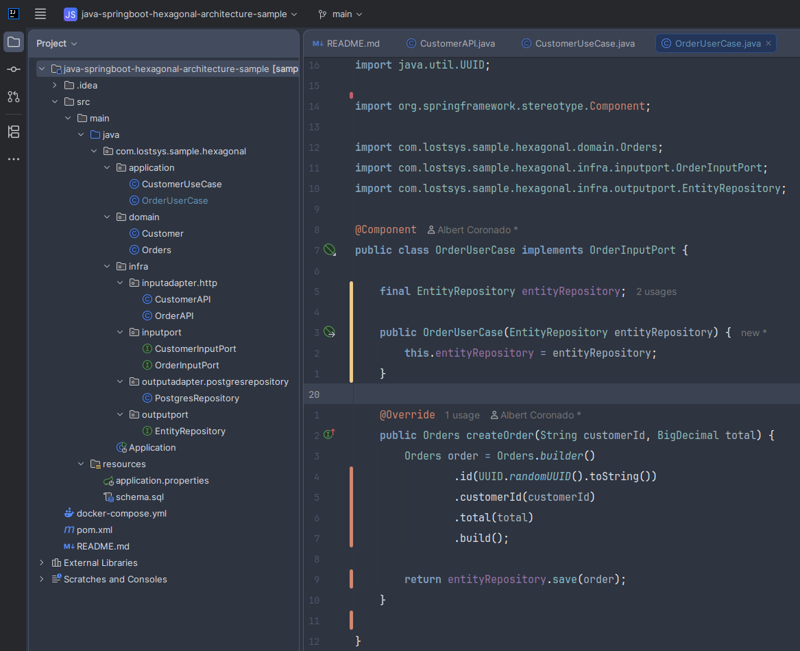
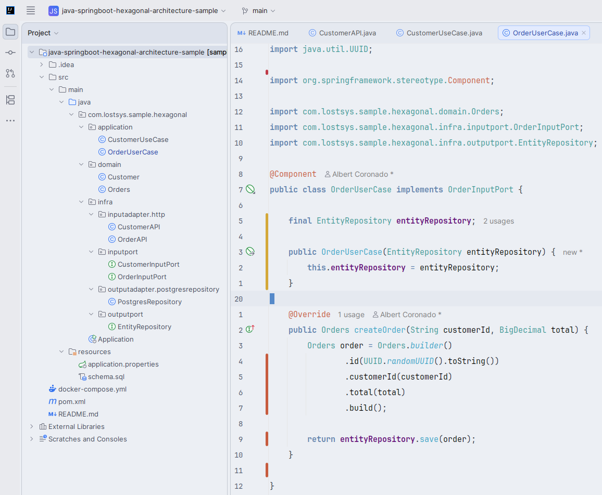
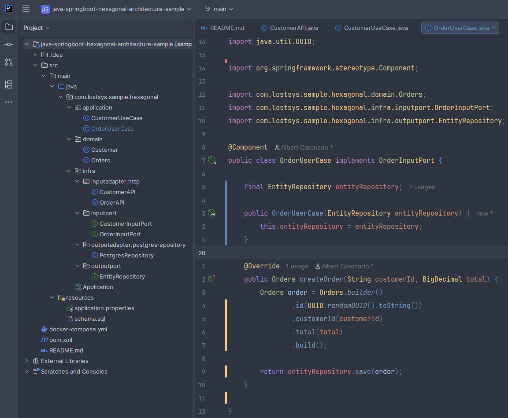
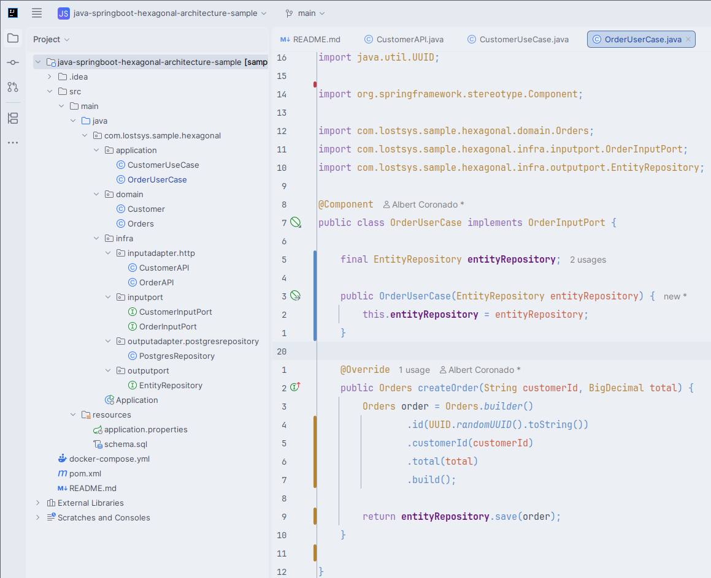

<div align="center">

# 🎨 Nord Recharged

### Beautiful Arctic-inspired color themes for IntelliJ IDEA

[](https://github.com/angelf015/NordRecharged/releases)
[](https://plugins.jetbrains.com/plugin/33028-nord-recharged)
[](https://plugins.jetbrains.com/plugin/33028-nord-recharged)
[](https://www.jetbrains.com/idea/)
[](LICENSE)

_Four carefully crafted themes combining the elegance of Nord with the familiarity of One Dark._

[Features](#features) • [Themes](#themes) • [Screenshots](#screenshots) • [Installation](#-installation) • [Usage](#-usage) • [Theme Comparison](#theme-comparison) • [Color Palette](#color-palette) • [Compatibility](#compatibility) • [Contributing](#contributing) • [Troubleshooting](#troubleshooting) • [Project Structure](#project-structure) • [Credits & Resources](#credits--resources)

</div>

---

## Features

Nord Recharged brings you four complete themes covering both sides of the spectrum:

- **4 complete themes** - Dark and light variants for both the Nord and OneNord styles.
- **100% official palettes** - Built with the genuine Nord colors plus the official OneNord palette.
- **Islands UI compatible** - Fully tuned for JetBrains' modern New UI.
- **Java optimized** - Dedicated Java syntax attributes configured out of the box.
- **Beyond Java** - Kotlin, Python, JavaScript, TypeScript, XML/HTML, and more.
- **Eye-friendly** - Designed for long coding sessions with comfortable contrast.
- **Actively maintained** - Regular updates so themes keep working across IDE releases.

---

## Themes

### Nord Recharged Dark

> Pure Nord palette with enhanced readability.

**Perfect for:** fans of the original Nord theme and minimalist aesthetics.

- Keywords in bold blue for better visibility.
- Comments in italic gray for clear distinction.
- Based on the official Nord JetBrains theme.

### Nord Recharged Light

> Inverted Nord palette for bright environments.

**Perfect for:** well-lit rooms and daytime coding.

- Same color philosophy as the dark variant.
- Optimized contrast for light backgrounds.
- Easy on the eyes in bright conditions.

### OneNord Dark Recharged

> Nord colors with a One Dark distribution.

**Perfect for:** Atom/VS Code One Dark users who enjoy a more colorful syntax.

- Purple keywords, just like One Dark.
- Yellow classes for better distinction.
- Red variables for instant recognition.
- Official OneNord palette by @rmehri01.

### OneNord Light Recharged

> One Light style with Nord palette.

**Perfect for:** One Light fans and lovers of vibrant light themes.

- Bright, saturated colors.
- Excellent contrast on light backgrounds.
- Official OneNord Light palette.

---

## Screenshots

### Nord Recharged Dark



**Color highlights:**

- `public`, `class`, `void` → **Blue** `#81A1C1` (Bold)
- `UserService`, `String`, `List` → **Cyan/Turquoise** `#8FBCBB`
- `findById`, `ArrayList` → **Cyan** `#88C0D0`
- `"Nord Theme"` → **Green** `#A3BE8C`
- `100`, `42` → **Purple** `#B48EAD`
- `// comments` → **Gray** `#616E88` (Italic)

### Nord Recharged Light



**Color highlights:**

- `public`, `class`, `void` → **Deep Blue** `#2F5F93` (Bold)
- `findById`, `ArrayList` → **Blue** `#446EA2`
- `"Nord Theme"` → **Green** `#4C7736`
- `100`, `42` → **Purple** `#905890`
- `// comments` → **Gray** `#4A5A6D` (Italic)

### OneNord Dark Recharged



**Color highlights:**

- `public`, `class` → **Purple** `#B589D3` (Bold)
- `UserService`, `String` → **Yellow** `#EBCB8B`
- `process` → **Blue** `#81A1C1`
- `name`, instance fields → **Red** `#D57780`
- `value`, parameters → **Orange** `#D08F70`

### OneNord Light Recharged



**Color highlights:**

- `public`, `class` → **Purple** `#8559A6`
- `UserService`, `String` → **Yellow** `#8C6523`
- `process` → **Blue** `#446EA2`
- `name`, instance fields → **Red** `#BF3A47`
- `value`, parameters → **Orange** `#AE5036`

---

## 🚀 Installation

### Method 1: From the JetBrains Marketplace (recommended)

1. Open IntelliJ IDEA.
2. Go to **Settings** (`Ctrl+Alt+S` / `Cmd+,`) → **Plugins**.
3. Switch to the **Marketplace** tab.
4. Search for **Nord Recharged**.
5. Click **Install**, then **Restart IDE**.
6. Go to **Settings** → **Appearance & Behavior** → **Appearance** → **Theme** and pick your theme.

You can also open the plugin page directly: [Nord Recharged on the JetBrains Marketplace](https://plugins.jetbrains.com/plugin/33028-nord-recharged)

### Method 2: Build from Source

```bash
# Clone the repository
git clone https://github.com/angelf015/NordRecharged.git
cd NordRecharged

# Build the plugin
./gradlew buildPlugin

# The plugin will be in:
# build/distributions/NordRecharged-1.4.0.zip
```

Then follow steps 2-6 from Method 1.

---

## ⚙️ Usage

Each theme is made of two parts, and both should be active for the full experience:

1. **UI Theme** - colors the whole IDE shell (toolbars, panels, buttons, tabs).
2. **Editor Color Scheme** - colors the code inside the editor (syntax highlighting).

### Activating the UI Theme

1. Go to **Settings** (`Ctrl+Alt+S` / `Cmd+,`) → **Appearance & Behavior** → **Appearance**.
2. Under **Theme**, select one of: *Nord Recharged Dark*, *Nord Recharged Light*, *OneNord Dark Recharged*, or *OneNord Light Recharged*.
3. The UI usually updates right away; restart if any panel looks off.

> **Tip:** If you use JetBrains' Islands (New UI), these themes are fully optimized for it - enable it in *Settings → Appearance → New UI*.

### Activating the Editor Color Scheme

1. Go to **Settings** → **Editor** → **Color Scheme**.
2. From the **Scheme** dropdown, pick the scheme matching your UI theme (for example, *Nord Recharged Light* together with *Nord Recharged Light*).
3. Click **Apply** → **OK**.

> **Important:** The plugin registers its editor schemes automatically, but if you reload the plugin or switch schemes, re-select the matching one from the dropdown above.

---

## Theme Comparison

| Feature        | Nord Recharged        | OneNord Recharged      |
| -------------- | --------------------- | ---------------------- |
| **Philosophy** | Pure Nord, minimalist | One Dark + Nord fusion |
| **Keywords**   | Blue `#81A1C1`        | Purple `#B589D3`       |
| **Classes**    | Cyan `#8FBCBB`        | Yellow `#EBCB8B`       |
| **Variables**  | Default text          | Red `#D57780`          |
| **Best For**   | Nord purists          | One Dark users         |
| **Feeling**    | Calm, focused         | Vibrant, expressive    |

---

## Color Palette

### Nord Dark Theme

| Element     | Color          | Hex       | Preview                                               |
| ----------- | -------------- | --------- | ----------------------------------------------------- |
| Keywords    | Blue           | `#81A1C1` |  |
| Strings     | Green          | `#A3BE8C` |  |
| Numbers     | Purple         | `#B48EAD` |  |
| Classes     | Cyan/Turquoise | `#8FBCBB` |  |
| Methods     | Cyan           | `#88C0D0` |  |
| Comments    | Gray           | `#616E88` |  |
| Annotations | Orange         | `#D08770` |  |

### OneNord Dark Theme

| Element   | Color  | Hex       | Preview                                               |
| --------- | ------ | --------- | ----------------------------------------------------- |
| Keywords  | Purple | `#B589D3` |  |
| Strings   | Green  | `#91C187` |  |
| Numbers   | Orange | `#D08F70` |  |
| Classes   | Yellow | `#EBCB8B` |  |
| Methods   | Blue   | `#81A1C1` |  |
| Variables | Red    | `#D57780` |  |
| Comments  | Gray   | `#6C7A96` |  |

---

## Compatibility

- **IntelliJ IDEA:** 2023.3+ (Ultimate & Community).
- **Build range:** 233 - 263.*.
- **Other JetBrains IDEs:** PyCharm, WebStorm, PhpStorm, and more.
- **Java version:** 17+ (only needed for building from source).

---

## Contributing

Contributions are always welcome:

1. **Fork** the repository.
2. **Create** a feature branch (`git checkout -b feature/amazing-feature`).
3. **Commit** your changes (`git commit -m 'Add amazing feature'`).
4. **Push** to the branch (`git push origin feature/amazing-feature`).
5. **Open** a Pull Request.

### Development Setup

```bash
# Clone your fork
git clone https://github.com/angelf015/NordRecharged.git

# Build and test
./gradlew buildPlugin

# Test in IntelliJ
# The plugin will be in build/distributions/
```

---

## Troubleshooting

### Colors are not applying

1. Verify the plugin is installed: **Settings** → **Plugins** → search "Nord Recharged".
2. Check the theme is selected: **Settings** → **Appearance** → **Theme**.
3. Try: **File** → **Invalidate Caches** → **Restart**.

### UI colors show, but no syntax highlighting

1. Check **Settings** → **Editor** → **Color Scheme**.
2. Make sure it matches your UI theme.
3. Rebuild the plugin: `./gradlew clean buildPlugin`.

### Theme appears but everything is gray

1. Reinstall the plugin.
2. Restart IntelliJ IDEA.

---

## Project Structure

```
NordRecharged/
├── resources/
│   ├── META-INF/
│   │   ├── plugin.xml          # Plugin configuration
│   │   └── pluginIcon.svg      # Plugin icon
│   ├── theme/                  # UI themes (.theme.json)
│   │   ├── nord-recharged-dark.theme.json
│   │   ├── nord-recharged-light.theme.json
│   │   ├── onenord-dark-recharged.theme.json
│   │   └── onenord-light-recharged.theme.json
│   └── colors/                 # Editor schemes (.xml)
│       ├── nord-recharged-dark.xml
│       ├── nord-recharged-light.xml
│       ├── onenord-dark-recharged.xml
│       └── onenord-light-recharged.xml
├── build.gradle.kts            # Build configuration
└── [Documentation files]
```

---

## Credits & Resources

- **Nord Palette:** [Arctic Ice Studio](https://www.nordtheme.com) & [Sven Greb](https://github.com/arcticicestudio/nord)
- **OneNord:** [Ryan Mehri](https://github.com/rmehri01/onenord-jetbrains)
- **One Dark:** [Atom Editor](https://github.com/atom/one-dark-syntax)
- **IntelliJ Platform SDK:** [JetBrains](https://plugins.jetbrains.com/docs/intellij/)

---

## License

This project is licensed under the MIT License - see the [LICENSE](LICENSE) file for details.

The Nord color palette is created by [Arctic Ice Studio](https://www.nordtheme.com) and is licensed under the MIT License.

---

## Show Your Support

If Nord Recharged is useful to you, there are a few ways to help:

- **Star** this repository.
- **Report** bugs or request features through the [Issues](https://github.com/angelf015/NordRecharged/issues) page.
- **Fork** the project and contribute improvements.
- **Share** it with other Nord theme lovers.

---

## Project Stats


---

<div align="center">

**Made with ❄️ and ☕ by the Nord Recharged Team**

_Nord Recharged - Where Arctic elegance meets modern development_

</div>